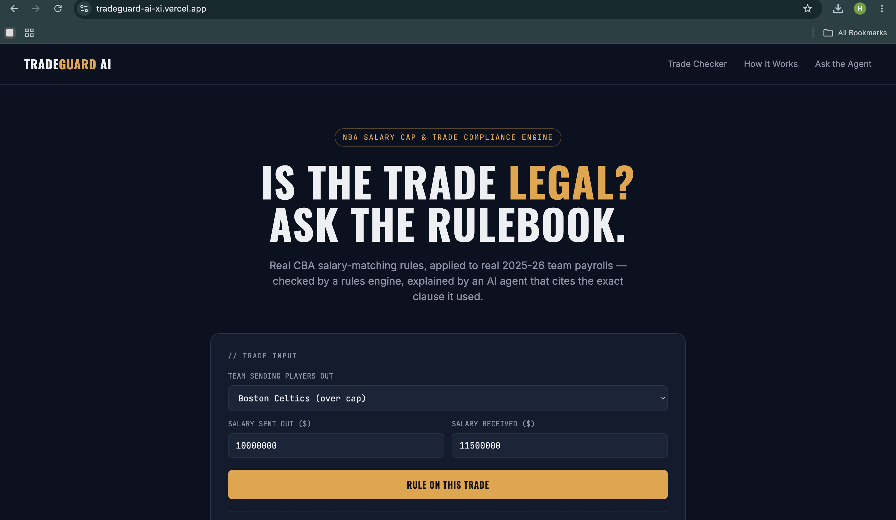
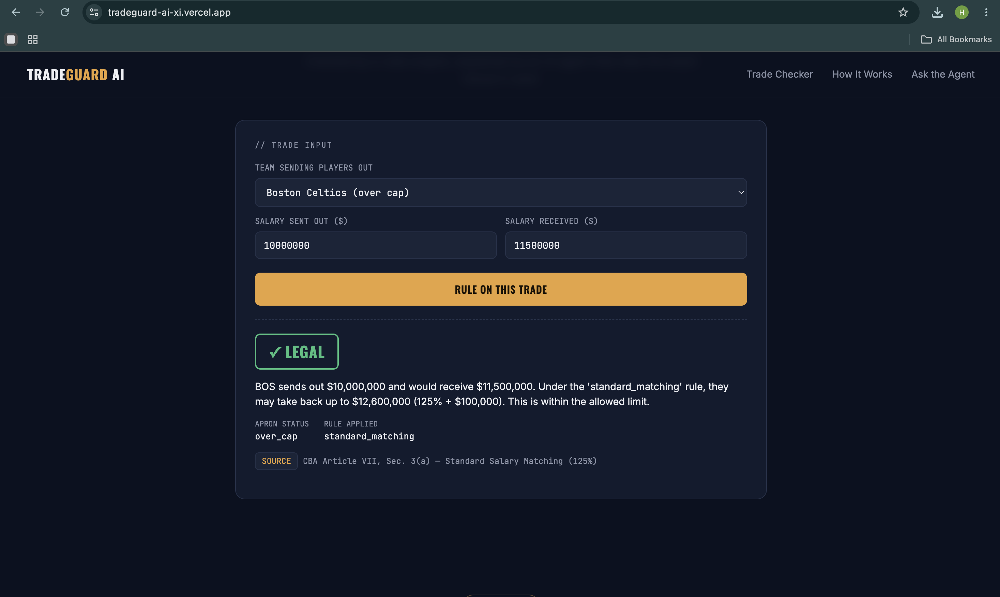
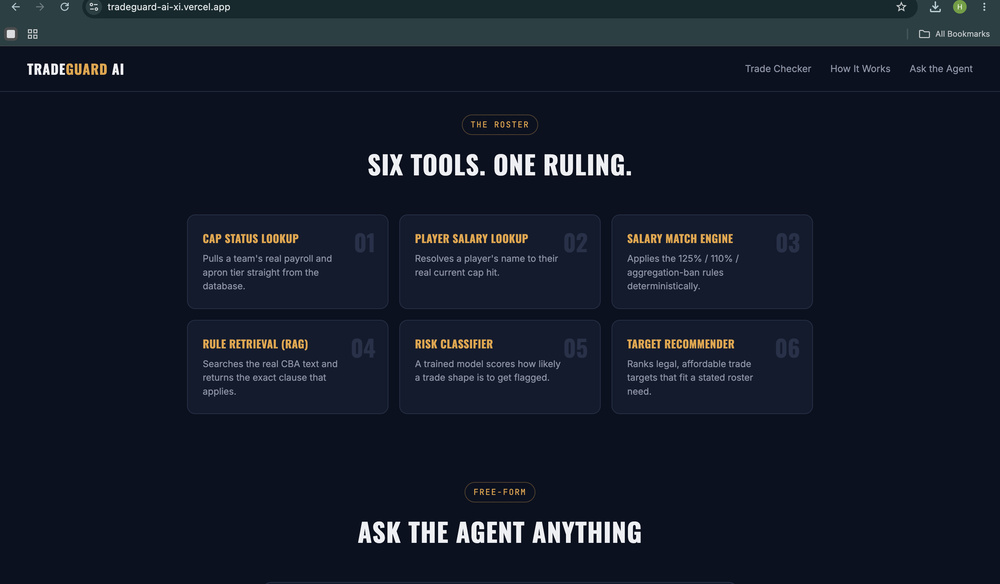
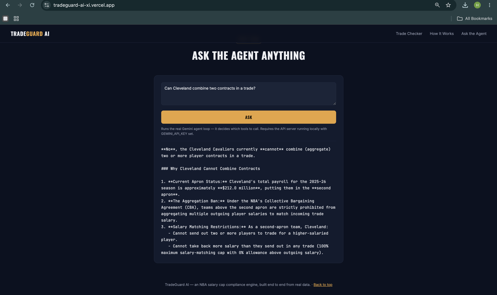

# TradeGuard AI

**An end-to-end agentic AI platform that evaluates NBA trade legality** — combining a real ETL pipeline, a deterministic CBA rules engine, a trained ML risk classifier, RAG retrieval over rule text, and an LLM agent that decides for itself which tools to call.

🔗 **Live site:** https://tradeguard-ai-xi.vercel.app
🔗 **Live API docs:** https://tradeguard-ai-ea0h.onrender.com/docs
🔗 **Code:** https://github.com/HarshaVardhanRepudi/tradeguard-ai-

> The backend runs on a free tier that spins down after inactivity — the first request after idle time can take 20-30s to wake up. This is expected, not a bug.

## What it does

Ask it whether a trade is legal, and it doesn't just guess — it looks up each team's real 2025-26 payroll, runs the actual CBA salary-matching math, retrieves the specific rule clause it relied on, and (via a real LLM agent) decides on its own which of these steps a given question actually needs.

```
Is Cleveland allowed to combine two contracts in a trade?
```
```
No. Cleveland is over the second apron ($211.98M payroll), and per CBA
Article VII, Sec. 5(a), second-apron teams cannot aggregate multiple
outgoing contracts to match a larger incoming salary.
```

## Screenshots

| | |
|---|---|
|  |  |
|  |  |

## Architecture

```
 Public data (Spotrac)                 CBA rule text (paraphrased)
        │                                       │
        ▼                                       ▼
   ETL pipeline                          RAG index (TF-IDF)
   (validate, compute                    retrieve_rules(query)
   payroll & apron tier)                        │
        │                                       │
        ▼                                       │
   SQLite database                              │
        │                                       │
   ┌────┴─────────────┐                         │
   ▼                   ▼                        │
Rules engine      ML risk model                  │
(deterministic     (RandomForest,                │
CBA math)          trained + evaluated)          │
   │                   │                         │
   └─────────┬─────────┴─────────────────────────┘
             ▼
      Agent tool layer (6 tools)
             │
             ▼
   LLM agent (Gemini, tool-use API)
   — decides which tools to call, in what order
             │
             ▼
        FastAPI backend  ──────►  Web frontend
        (7 REST endpoints)        (deployed on Vercel)
```

## Tech stack & why

| Layer | Tech | Why this, not the obvious alternative |
|---|---|---|
| Data | Spotrac (real, public) | Real facts, not fabricated — verified against a third-party apron tracker |
| Storage | SQLite | Zero-setup, portable; schema is Postgres-ready if scaled |
| Rules | Plain Python (no framework) | The CBA has sharp threshold logic — deterministic code is more correct and auditable than asking an LLM to "remember" percentages |
| ML | scikit-learn RandomForest | Handles threshold-like decision boundaries naturally; 5 features / 400 rows doesn't need a neural net |
| RAG | TF-IDF (scikit-learn) | No internet access in the dev sandbox for downloading embedding models — same `retrieve_rules()` interface as a neural version, swappable later |
| Agent | Google Gemini (tool-use API) | Genuinely free tier for a portfolio project, real function-calling support |
| API | FastAPI | Auto-generated docs, type-validated requests |
| Frontend | Vanilla HTML/CSS/JS | No build step, deploys as a static site in seconds |

## Quickstart (run it yourself)

```bash
git clone https://github.com/HarshaVardhanRepudi/tradeguard-ai-
cd tradeguard-ai-
pip3 install -r requirements.txt

python3 etl/load.py                    # builds the database from real + seed data
python3 ml/generate_training_data.py   # builds the labeled trade dataset
python3 ml/train_model.py              # trains + evaluates the risk classifier

# Terminal 1
python3 api/main.py

# Terminal 2
cd frontend && python3 -m http.server 5500
```
Open `http://localhost:5500`. For the `/ask` agentic endpoint, also set
`GEMINI_API_KEY` (free key: aistudio.google.com/apikey) before starting the API.

## Tests

```bash
python3 -m pytest tests/ -v
```
Covers the deterministic rules engine (`salary_matching.py`) — the piece where
correctness matters most, since it's pure business logic with no LLM involved.

## What's real vs. placeholder (full honesty)

- **Real:** salary cap / apron dollar figures (2025-26, verified from NBA.com/ESPN)
- **Real:** the salary-matching math (125% / 110% / aggregation-ban logic)
- **Real:** CBA rule text — paraphrased from real provisions and Larry Coon's CBA FAQ
- **Real player/contract data (6 of 11 teams):** CLE, GSW, LAL, BOS, DAL, PHX — from
  Spotrac's public cap tables. All three CBA rule tiers proven against these real teams,
  including one case where a computed payroll independently matched a third-party apron
  tracker's figure within ~$300K
- **Still placeholder:** DEN, MIL, OKC, NYK, MIA — all land at `under_cap` either way, so
  they don't currently exercise a new rule branch
- **ML risk model:** trained on 400 rule-grounded synthetic trades + 5 real anchor trades
  from the 2025-26 deadline. Test accuracy 0.99 / F1 0.99 / ROC-AUC 1.00 — expected to be
  near-perfect since most labels come from a deterministic function, not noisy real-world
  outcomes. This is a learned approximation of CBA logic, not a predictor of real
  negotiation outcomes — an intentional, documented scoping choice
- **RAG:** TF-IDF, not neural embeddings, due to no internet access in the dev sandbox —
  same interface either way, swap is isolated to one function

## Repo layout
- `etl/` — schema, loader, and the deterministic rules engine
- `rag/` — TF-IDF rule retrieval
- `ml/` — training data generation, classifier training, fit/recommendation scoring
- `agent/` — tool schemas, the real Gemini agent loop, a Claude version, and an offline
  mock router used to test tool-selection logic without internet access
- `api/` — FastAPI backend, 7 endpoints
- `frontend/` — the deployed web UI
- `tests/` — pytest suite for the rules engine
- `data/raw/` — all seed and sourced CSVs

## Talking points this project is built to survive
- Why separate the deterministic rules engine from the LLM, instead of just asking the LLM?
- Why RandomForest over a neural network for the risk model?
- How does the RAG retrieval actually work, and what happens if you feed it a wrong rule?
- How does the agent decide which tools to call — walk through a real example.
- What's fabricated here vs. real, and how would you know the difference?
- How would this scale to all 30 teams and real-time data?
